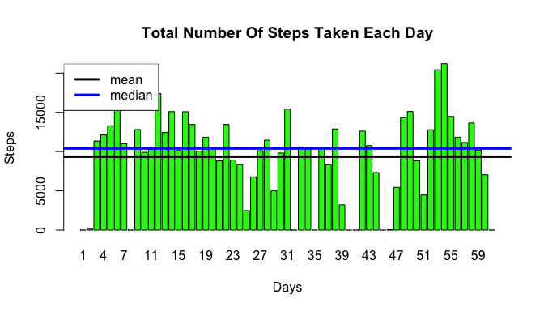
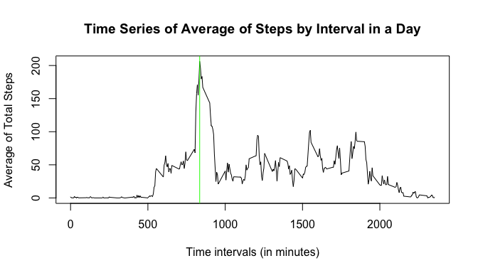
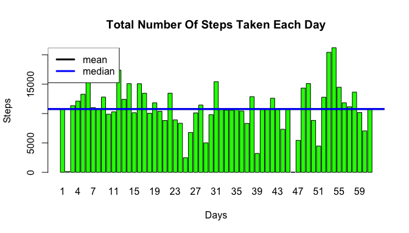
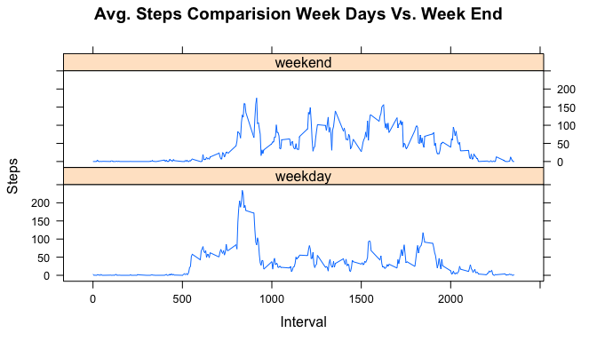

# PA1_template.Rmd
Naeem B  
5/27/2018  
# Introduction
Data about personal movement using activity monitoring devices such as FITBIT. This device collects data at 5 minute intervals through out the day. The data consists of two months of data from an anonymous individual collected during the months of October and November, 2012 and include the number of steps taken in 5 minute intervals each day.

## The purpose of this project was to practice:

    Loading and transforming data
    Exploratory Analysis
    Creat Markdown Document


##Data

The data for this assignment can be downloaded from the course web site:

Dataset: Activity monitoring data [52K]
The variables included in this dataset are:

steps: Number of steps taking in a 5-minute interval (missing values are coded as NA)

date: The date on which the measurement was taken in YYYY-MM-DD format

interval: Identifier for the 5-minute interval in which measurement was taken

The dataset is stored in a comma-separated-value (CSV) file and there are a total of 17,568 observations in this dataset.

## 1. Loading and preprocessing the data

```r
library(lubridate)
library(lattice)
setwd("~/RWorks/ReproducibleResearch")
dsActivity <- read.csv("activity.csv",header=TRUE)
dsActivity$date<-as.Date(dsActivity$date ,format = "%Y-%m-%d",na.rm=T)
dsActivity$day <- yday(dsActivity$date)
dsActivity$day <- dsActivity$day - min(dsActivity$day) + 1
head(dsActivity)
```

```
##   steps       date interval day
## 1    NA 2012-10-01        0   1
## 2    NA 2012-10-01        5   1
## 3    NA 2012-10-01       10   1
## 4    NA 2012-10-01       15   1
## 5    NA 2012-10-01       20   1
## 6    NA 2012-10-01       25   1
```
## 2. What is mean total number of steps taken per day?    


```r
stepsPerDay<-tapply(dsActivity$steps,dsActivity$day,FUN=sum,na.rm=T)
barplot(stepsPerDay,xlab="Days",ylab="Steps",main="Total Number Of Steps Taken Each Day", col="green")
abline(h=mean(stepsPerDay,na.rm=T),col="black",lwd=3)
abline(h=median(stepsPerDay,na.rm=T),col="blue",lwd=3)
legend("topleft", lty=1,lwd=3,col=c("black","blue"),legend=c("mean","median"))
```

 
   
**Mean and Median**  

```
## [1] "Mean For Total Number Of Steps Taken Per Day Is 9354.22950819672"
```

```
## [1] "Median For Total Number Of Steps Taken Per Day Is 10395"
```

## 3. What is the average daily activity pattern?  

```r
IntervalMean <- tapply(dsActivity$steps,dsActivity$interval,mean,na.rm=TRUE)
plot(row.names(IntervalMean),IntervalMean,type="l",xlab="Time intervals (in minutes)",
     ylab="Average of Total Steps",
     main="Time Series of Average of Steps by Interval in a Day")
abline(v=names(IntervalMean)[which(IntervalMean==max(IntervalMean))],col="green")
```

 

**Ineterval at Max Value:**

```
## [1] "835"
```

## 4. Imputing missing values 

```r
dsActivityImputed <-dsActivity
print(paste('Total Missing Values',  sum(is.na(dsActivityImputed$steps)==TRUE)))
```

```
## [1] "Total Missing Values 2304"
```

```r
x<-data.frame(interval=names(IntervalMean),value=IntervalMean)
for (idx in which(is.na(dsActivityImputed$steps)==T))
{
  dsActivityImputed[idx,'steps']<- x[dsActivityImputed[idx,'interval']==x$interval,'value']
}
StepsPerDay<-tapply(dsActivityImputed$steps,dsActivityImputed$day,FUN=sum)
barplot(StepsPerDay,xlab="Days",ylab="Steps",main="Total Number Of Steps Taken Each Day", col="green")
abline(h=mean(StepsPerDay,na.rm=T),col="black",lwd=3)
abline(h=median(StepsPerDay,na.rm=T),col="blue",lwd=3)
legend("topleft", lty=1,lwd=3,col=c("black","blue"),legend=c("mean","median"))
```

 

## 5. Are there differences in activity patterns between weekdays and weekends?

```r
dsActivity$daytype <- ifelse(weekdays(dsActivity$date) %in% c("Saturday","Sunday"),"weekend","weekday") 

dsWeekDay <- with (dsActivity[dsActivity$daytype=="weekday",],
                 aggregate(steps~ interval, FUN = mean,rm.na=T)
                )
dsWeekDay$daytype = "weekday"

dsWeekend <- with (dsActivity[dsActivity$daytype=="weekend",],
                       aggregate(steps~ interval, FUN = mean,rm.na=T)
                )
dsWeekend$daytype = "weekend"
dsSteps <- rbind(dsWeekDay,dsWeekend)


xyplot(dsSteps$steps~dsSteps$interval|dsSteps$daytype,data=dsSteps,layout=c(1,2),type="l",xlab="Interval",ylab="Steps",main="Avg. Steps Comparision Week Days Vs. Week End")
```

 
